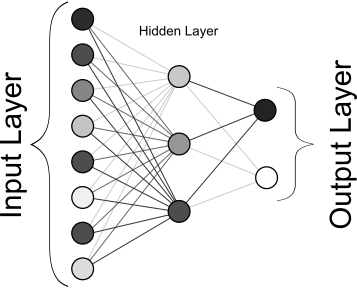

<h1 style="font-family:Times;text-align:center;margin-bottom:0;padding-bottom:10px">Image Recognition & Machine Learning Andrew Woo, 2020</h1>
<h3 style="font-family:Times;text-align:center;margin:0">based on 3Blue1Brown's Neural Network Series</h3>

<!-- -->

## Abstract
This programming challenge is my introduction to AI, or more specifically, the machine learning aspect of AI. It will attempt to correctly classify hand-written numbers using [Multilayer Perceptron][multilayer-perceptron]. This challenge is an attempt to put into practice [3Blue1Brown's][3b1b] example in his [Neural Network Series][3b1b-series] from scratch. The language of choice for this challenge is Python, as it is widely considered the "best" option for machine learning and AI. The libraries used within will change as the challenge progresses. C++ was not chosen due to its low level status, as it would be too difficult to implement many of the necessary features as compared to Python.

The purpose of this document is simply to organize my thoughts into a single location. It thus acts as my documentation for this challenge/project.

DISCLAIMER: THIS IS NOT A SCHOLARLY ARTICLE. PORTIONS MAY BE INACCURATE OR FACTUALLY INCORRECT.

## Introduction
Neural Networks are, in the most simplest term, multi-layered polymorphic mathematical functions, consisting of $x$ inputs and $y$ outputs. \
In this case, the inputs are the pixel "activations," where activation means the greyscale value between $0$ and $1$ of each pixel in the image that is being analyzed. For this challenge, the [MNIST Database][mnist] will be used. Each image in this database contains a $28\times28$ grid, for a total of $784$ pixels. \
Between the input layer and the output layer, there are an arbitrary number of "hidden-layers." These hidden layers apply a mathematical function to the inputs, generally using all of the inputs to create a single output for multiple nodes, or neurons, in the network:

Each neuron in the hidden layer is given a value by summing the activation values of each weighted input neuro, then adding a neuron-specific bias to the sum:

!!! note Input Layer $\rightarrow$ Hidden Layer
    $$\space$$
    $$\sum_{n=1}^{784}(w_na_n)+b$$ (1)
    $a_n=\text{activation value}$ \
    $w_n=\text{weight}$ \
    $b=\text{neuron specific bias}\space$

This bias ensures that the activation level of the neuron is essentially zero, such that the neuron is only "active" when the input neurons match a specific criteria. At first, these biases are randomly chosen, and then the neural network alters them through back-propogation. However, this formula would output an arbitrary value that is difficult to work with, as the values could theoretically range from $-\infty$ to $+\infty$. Thus, the sum must be "squished" between $0$ and $1$ using the sigmoid function:

!!! note Weighted Sum $\rightarrow$ Sigmoid-ed Sum
    $$\space$$
    $$\sigma(x)=\frac{1}{1+e^{-x}}$$ (2)
    $x=\text{weighted sum}\space$ 

For this challenge, these functions will be applied to every node for every iteration. Since there are four layers, there will be three "sets" of connections which the functions will be applied to. The first "set" is between the input layer and the first hidden layer, such that the number of calculations done is $784\times16$. Then, hidden layer to hidden layer, $16\times16$. And finally hidden layer to output layer, $16\times10$. Adding these up results in a total of $12,960$ weighted sums per iteration. Further, there is a bias for every neuron, such that between the input layer and the first hidden layer, there are $16$ biases, $16$ between hidden layers, and $10$ biases for the output layer.

!!! note Calculations per Iteration
    $\text{Weights}\rightarrow 12,960=(784\times16)+(16\times16)+(16\times10)$ \
    $\text{Biases}\rightarrow 42 = 16+16+10$ \
    $\text{Total}\rightarrow 13,002 = 12,960 + 42$

Clearly, this is a disproportionately large number of calculations, and thus would take far too long. As such, a new method of calculating each of these weighted sums and biases is required. This can be done using a sigmoided matrix-vector sum, such that the activations of a layer are a vector, and their weights are a matrix:

!!! note Matrix-Vector Math

    $\text{Weights}\times\text{Activations}+\text{Biases:}\space$

    $$\begin{bmatrix}
    w_{0,0} & w_{0,1} & \ldots & w_{0,n}\\
    w_{1,0} & w_{1,1} & \ldots & w_{1,n}\\
    \vdots & \vdots & \ddots & \vdots\\
    w_{k,0} & w_{k,1} & \ldots & w_{k,n}\\ \end{bmatrix}
    \begin{bmatrix}a_0\\a_1\\\vdots\\a_n\end{bmatrix}+
    \begin{bmatrix}b_0\\b_1\\\vdots\\b_n\end{bmatrix}$$ (3)

    $\text{then, sigmoided:}\space$

    $$\sigma\begin{pmatrix}\begin{bmatrix}
    w_{0,0} & w_{0,1} & \ldots & w_{0,n}\\
    w_{1,0} & w_{1,1} & \ldots & w_{1,n}\\
    \vdots & \vdots & \ddots & \vdots\\
    w_{k,0} & w_{k,1} & \ldots & w_{k,n}\\ \end{bmatrix}
    \begin{bmatrix}a_0\\a_1\\\vdots\\a_n\end{bmatrix}+
    \begin{bmatrix}b_0\\b_1\\\vdots\\b_n\end{bmatrix}\end{pmatrix}$$  (4)

    $a_n=\text{activation value}$ \
    $w_{k,n}=\text{weight}$ \
    $b_n=\text{neuron specific bias}\space$

Once these calculations are completed for every neuron, it produces an output value for each neuron in the output layer. However, multiple neurons may be activated, such that the neural-network generated output may not equal the true value. Thus, the network must "learn" to alter the weights and biases for each neuron in search of the perfect weight and bias for every neuron. This is done by first calculating the "cost" of one training example.

!!! note Cost Calculation
    $$\space$$
    $$\text{cost}=\sum_{n=0}^{9}(o_n-r_n)^2$$ (5)
    $o_n=\text{neuron specific output}$ \
    $r_{n}=\text{true neuron specific value}\space$

The network's measure of accuracy can then be calculated by averaging the cost of every training sample:

!!! note Network Accuracy
    $$\space$$
    $$\text{accuracy}=\dfrac{\Sigma\space\text{costs}}{s}$$ (6)
    $s=\text{sample size}\space$ \
    $\text{costs = sum of all training sample costs}\space$

To ensure a greater accuracy, the cost of the network must be reduced. This can be done through gradient descent,

<!-- Links -->
[multilayer-perceptron]: https://en.wikipedia.org/wiki/Multilayer_perceptron
[3b1b]: https://www.youtube.com/channel/UCYO_jab_esuFRV4b17AJtAw
[3b1b-series]: https://www.youtube.com/playlist?list=PLZHQObOWTQDNU6R1_67000Dx_ZCJB-3pi
[mnist]: http://yann.lecun.com/exdb/mnist/

<!-- 

NOTE: ReLU(a) = max(0, a) -> f(a) > 0 = a, f(a) < 0 = 0

-->

<!-- Resources 

Markdown, Math
https://oeis.org/wiki/List_of_LaTeX_mathematical_symbols
https://github.com/adam-p/markdown-here/wiki/Markdown-Cheatsheet
https://www.markdownguide.org/extended-syntax/
https://www.markdownguide.org/cheat-sheet/

MNIST Database
http://yann.lecun.com/exdb/mnist/

3Blue1Brown
https://www.youtube.com/channel/UCYO_jab_esuFRV4b17AJtAw
https://www.youtube.com/playlist?list=PLZHQObOWTQDNU6R1_67000Dx_ZCJB-3pi

Multilayer Perceptron
https://en.wikipedia.org/wiki/Multilayer_perceptron

Hidden Layers
https://stats.stackexchange.com/questions/63152/what-does-the-hidden-layer-in-a-neural-network-compute

-->
